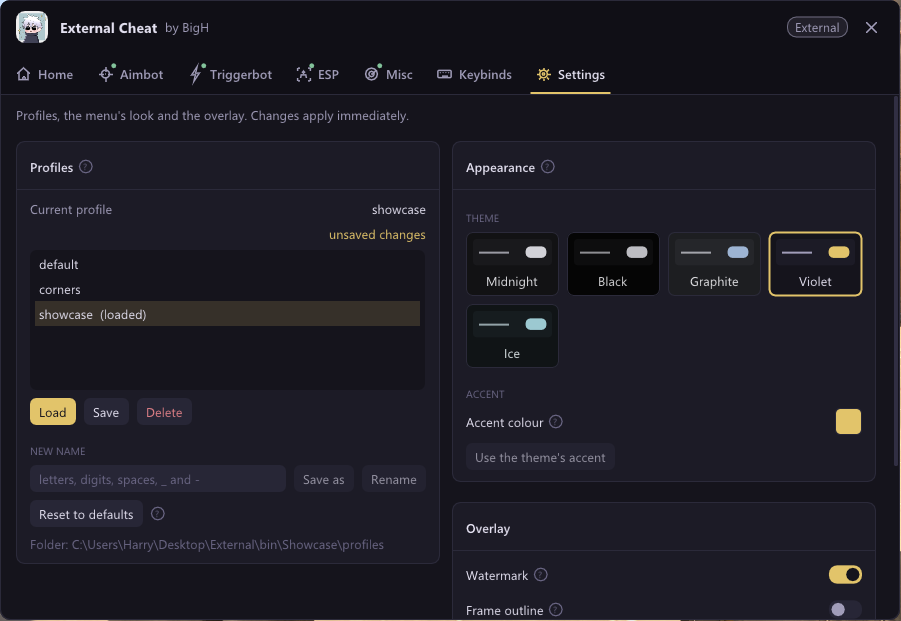
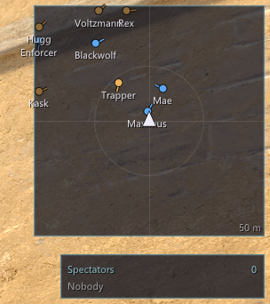

# ExternalCheat

**An external Counter-Strike 2 cheat with a kernel-mode memory backend.**

Runs entirely in its own process. Never injects into the game. Reads and writes game memory through a custom driver that is manually mapped into the Windows kernel.

---

## Table of contents

- [What this is](#what-this-is)
- [Architecture](#architecture)
- [Memory access flow](#memory-access-flow)
- [The overlay](#the-overlay)
  - [Menu — Home](#menu--home)
  - [Menu — Aimbot](#menu--aimbot)
  - [Menu — Triggerbot](#menu--triggerbot)
  - [Menu — ESP](#menu--esp)
  - [Menu — Misc](#menu--misc)
  - [Menu — Keybinds](#menu--keybinds)
  - [Menu — Settings](#menu--settings)
- [In-game HUD](#in-game-hud)
  - [ESP](#esp)
  - [Radar](#radar)
  - [Watermark](#watermark)
- [Offset resolution](#offset-resolution)
- [Project layout](#project-layout)
- [Building](#building)
- [Running](#running)
- [Diagnostics](#diagnostics)
- [Troubleshooting](#troubleshooting)
- [Notes and limitations](#notes-and-limitations)

---

## What this is

ExternalCheat is a study project. It exists to explore four things that are interesting on their own:

- **Windows kernel programming.** A real driver with an IOCTL surface, PEB walking, and cross-process memory copies.
- **PE parsing.** Reading headers, sections, and imports out of a live process.
- **The Source 2 schema system.** Walking the game's own reflection data instead of hardcoding every field.
- **D3D11 / Dear ImGui overlays.** A topmost, layered, click-through window that draws on top of the game without ever taking focus.

It is *not* intended for live VAC-secured servers. It is built for `-insecure` bot matches so the memory-reading side can be tested and understood in isolation.

---

## Architecture

The system is split into two Visual Studio projects in one solution.

**`BigHDriver`** — the kernel-mode driver.

It is loaded with KDMapper, so it is not registered as a Windows service. It does not show up in `sc query` or `driverquery`. Once mapped, it stays resident until the machine reboots.

It exposes one symbolic link:

    \\.\x9f2a3b

and a small set of IOCTLs:

| Command           | Code  | Purpose                                                          |
| ----------------- | ----- | ---------------------------------------------------------------- |
| `init_code`       | 0x9A1 | Attach to a target PID.                                          |
| `read_code`       | 0x9A2 | Copy memory from the target process into the caller.             |
| `write_code`      | 0x9A3 | Copy memory from the caller into the target process.             |
| `get_pid_code`    | 0x9A4 | Resolve a PID from an image name (kernel process-list walk).     |
| `get_module_code` | 0x9A5 | Resolve a module base and size from a name (target PEB walk).    |

**`external`** — the user-mode application.

It opens a handle to `\\.\x9f2a3b`, resolves the game PID, attaches, resolves `client.dll` and `engine2.dll`, and then runs the feature logic each frame against a `core::Memory` abstraction. It never calls `ReadProcessMemory` or `WriteProcessMemory`; every read and write is a `DeviceIoControl` round trip.

---

## Memory access flow

1. User-mode opens `\\.\x9f2a3b`.
2. `get_pid_code("cs2.exe")` — the driver walks `ActiveProcessLinks` and returns the PID.
3. `init_code(pid)` — the driver looks up the `PEPROCESS` and stores it.
4. `get_module_code(pid, "client.dll")` and `get_module_code(pid, "engine2.dll")` — the driver attaches to the target's address space, walks the PEB `InLoadOrderModuleList`, and returns each module's base and size.
5. Every subsequent read and write is a `read_code` / `write_code` IOCTL that ends in `MmCopyVirtualMemory` on the kernel side.

Moving PID and module lookup into the kernel means the user-mode process never calls `CreateToolhelp32Snapshot` or `Module32First`, both of which are heavily instrumented by anti-cheat user-mode hooks.

---

## The overlay

The overlay is a topmost, layered, click-through window rendered with Dear ImGui on D3D11. It tracks the game window's client area each frame and draws ESP, HUD elements, and the menu.

Below are the menu pages as they actually look.

### Menu — Home

The Home page summarises what's currently active, the read/write timings, and the current profile. It's the first thing you see when the menu opens.

### Menu — Aimbot

FOV, smoothing, target bone selection, visibility checks, and per-feature toggles. Smoothing is defined per 60 Hz frame and scaled to the real frame time so it feels consistent at any overlay frame rate.

### Menu — Triggerbot

Reaction delay, shot delay, burst mode, and an optional head-only mode that requires the crosshair ray to pass within a small world-space radius of the head bone.

### Menu — ESP

Everything the ESP can draw: boxes, health bars, names, distance, snaplines, skeleton, and visibility-based colours. Each element has its own toggle, so the ESP can be as loud or as quiet as you want.

### Menu — Misc

Radar, bomb timer, spectator list. Also the less visual stuff — the menu key, the panic key, and the overlay visibility toggle.

### Menu — Keybinds

Every action in the tool is bindable. The Keybinds page also shows whether a bind is currently held, so you can verify before you go into a match.

### Menu — Settings

Profiles, theme, UI scale, and the diagnostic toggles.

Themes are pluggable and the whole UI is recoloured from a single palette — here's the violet theme:

---

## In-game HUD

### ESP

The ESP draws in the same pass as the menu, but only when the game window is focused.

Full ESP — boxes, health bars, names, distance, weapon:

Corner-only — the same data, just the four corners of each box, which is what a lot of people use when they want a clean screen:

### Radar

A top-down radar drawn in the corner of the game window. Facing lines, edge fade for players outside the radar range, and an arrow for your own position:

### Watermark

A small watermark in the top-left corner showing the current profile and how long the overlay has been running. Useful for confirming at a glance that the tool is attached and reading frames:

---

## Offset resolution

Offsets change on every CS2 update, so the project uses a layered approach instead of trusting any single source.

- **Dumps.** `game/offsets.h` and `game/schema.h` hold the offsets and schema field layouts as captured by a dumper. These are the source of truth for the build they correspond to.
- **Signature scanning.** `game/signatures.h` holds byte patterns for the key globals. On startup, the tool copies `client.dll`'s `.text` section and resolves each global by pattern, so a slightly shifted offset still lands correctly.
- **Live schema.** For class fields (`C_CSPlayerPawn`, `C_BaseEntity`, `CCSPlayerController`, and so on), the tool reads the schema system out of the running game rather than trusting the dump. This catches field moves that a signature scan can't.
- **Validation.** All of the above is checked at runtime by `--diag` (see below).

If a build is wrong, `--diag` tells you exactly which checks failed, which is usually enough to know what a fresh dump needs to capture.

---

## Project layout

    src/external/
      app/          startup, mode selection (overlay / --diag / --live), frame loop
      core/         Memory interface, ProcessMemory, KernelInterface, PE, pattern scan, logging
      features/     aimbot, triggerbot, ESP, radar, bomb timer, spectators, targeting
      game/         offsets, schema, signatures, entity readers, view matrix, weapons, bones
      input/        key polling, keybinds, bind capture
      maths/        vectors, angles, projection, skeletons
      render/       panel and primitive drawing
      settings/     profile storage (JSON), presets, themes
      ui/           ImGui overlay: window, menu, pages, HUD, widgets
      vendor/       Dear ImGui, nlohmann/json, doctest

---

## Building

Requirements: Visual Studio 2022, Desktop C++ workload, WDK, Windows 10/11 SDK.

1. Open `cs2-external.sln`.
2. Set the configuration to **Release | x64**.
3. **Build → Build Solution**.
4. Outputs:
   - Driver: `BigHDriver/bin/x64/Release/BigHDriver.sys`
   - Cheat: `external/bin/x64/Release/cs2_external.exe`

The driver is deliberately unsigned. It is loaded with KDMapper, not the Service Control Manager.

---

## Running

> Test offline only. This is intended for `-insecure` bot matches, never a VAC-secured server.

1. In the VM, restore the clean snapshot with Tamper Protection, Memory Integrity (HVCI), and the Vulnerable Driver Blocklist all disabled.
2. From an **Administrator** command prompt:

       kdmapper.exe BigHDriver.sys

3. Launch CS2 with `-insecure` and join a Practice with Bots match.
4. Run the cheat as **Administrator**:

       cs2_external.exe

The console prints the driver connection, the game PID, the module bases, and then either draws the overlay or runs the chosen diagnostic mode.

---

## Diagnostics

Two non-overlay modes, useful after a CS2 update.

`cs2_external.exe --diag` runs the offset diagnostic and exits. It checks the game build, resolves each interface via the module's `InterfaceReg` list, scans every signature, and reads every schema field, printing OK/FAIL for each. Anything that fails tells you what a fresh dump needs to capture.

`cs2_external.exe --live` prints a console table of every player each tick: team, name, health, armour, weapon, position, distance, and observer state.

Both modes use the same memory backend as the overlay, so if they work, the overlay will.

---

## Troubleshooting

| Symptom                                    | Likely cause                                         | Fix                                                                 |
| ------------------------------------------ | ---------------------------------------------------- | ------------------------------------------------------------------- |
| KDMapper returns `0xC0000603`              | Vulnerable Driver Blocklist re-enabled               | Set `VulnerableDriverBlocklistEnable` to `0`, reboot                |
| BSOD on mapping                            | Memory Integrity (HVCI) re-enabled                   | Turn Memory Integrity OFF, reboot                                   |
| Driver maps but modules read as `size 0x0` | `SizeOfImage` field moved in `LDR_DATA_TABLE_ENTRY`  | Read PE headers from the target instead of trusting the driver      |
| `--diag` reports many signature failures   | CS2 updated since the last dump                      | Re-run the dumper, update `offsets.h` and `signatures.h`            |
| Overlay doesn't line up with the game      | Window moved or resolution changed                   | The overlay tracks the game window each frame; check `cover()`      |
| Console prints "not in a match"            | Not in a live game                                   | Join a Practice with Bots match                                     |

---

## Notes and limitations

- **The driver is not unloadable.** KDMapper does not register a `DriverUnload` routine, so once mapped it stays in memory until reboot. To update the driver, reboot the machine.
- **The mapper's footprint is the main risk.** KDMapper depends on a publicly known vulnerable driver. The cheat itself never injects into the game and never calls the usual user-mode memory APIs.
- **Offsets rot.** Any CS2 update invalidates the dumps. `--diag` tells you exactly what moved.
- **Behaviour is server-visible.** An external cheat can hide its memory reads, but it cannot hide what the player does with the information.

---

Built as a study project. Read it, build it, break it, fix it.

